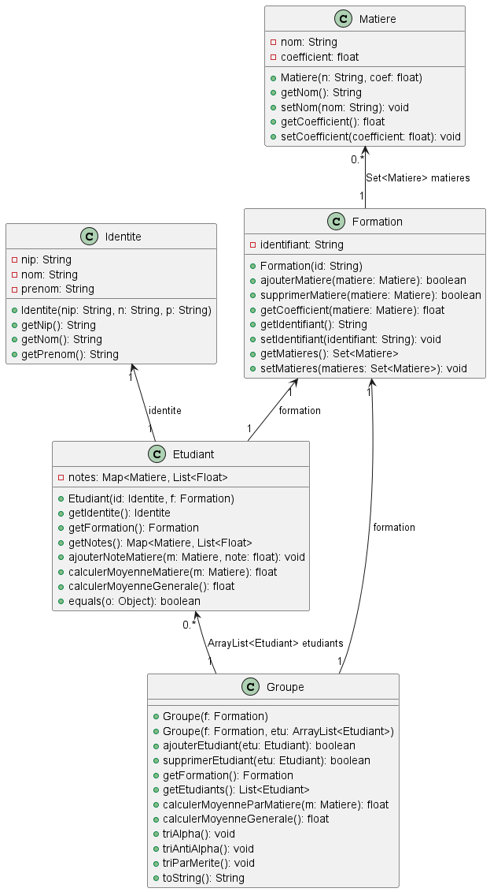

# R3-04_TP2_partie2 FORMATION

**S3A**
- **PIERROT** Nathan 
- **TROHA** Stanislas 

## [Dépendances](r3-04-tp2-partie2-equipe-pierrot_troha.iml) :
**Concernant les versions utilisées dans ce projet :**  
- Java : [*version 17*](https://www.oracle.com/java/technologies/javase/jdk17-archive-downloads.html)
- JUnit : [*version 5.8.1*](https://junit.org/junit5/docs/5.8.1/api/index.html)

*Les dépendances sont retrouvables dans ce fichier .iml :* [config.xml](r3-04-tp2-partie2-equipe-pierrot_troha.iml)

--- ---
*Les différentes branches contenant les différentes versions de l'application ont été conservées et sont accessibles depuis ce projet git*
* [fct_moyennes](https://github.com/IUTNancyCharlemagne/r3-04-tp2-partie2-equipe-pierrot_troha/tree/fct_moyennes)
* [fct_tris](https://github.com/IUTNancyCharlemagne/r3-04-tp2-partie2-equipe-pierrot_troha/tree/fct_tris)
* [fct_merite](https://github.com/IUTNancyCharlemagne/r3-04-tp2-partie2-equipe-pierrot_troha/tree/fct_merite)
--- ---
### Choix des collections
*Concernant les différentes Collections utilisées par rapport à chaque question :*  

**1) Résultats d'un étudiant [Etudiant](ProjetFormation/src/Etudiant.java):**    
Nous avons décidé de représenter la collection des résultats d'un étudiant sous la forme d'une [*HashMap*](https://docs.oracle.com/javase/8/docs/api/java/util/HashMap.html). Ainsi, pour chaque matière (clé) on peut accéder à la collection des notes de l'étudiant, que nous avons choisi de représenter sous la forme d'une [*ArrayList<Float>*](https://docs.oracle.com/javase/8/docs/api/java/util/ArrayList.html).  

**2) Collection des matières dans [Formation](ProjetFormation/src/Formation.java) :**    
Concernant la collection de matières dans la classe [Formation](ProjetFormation/src/Formation.java) nous avons choisi de la représenter sous la forme d'un ensemble [HashSet](https://docs.oracle.com/javase/8/docs/api/java/util/HashSet.html) pour assurer l'unicité d'une matière dans l'ensemble.
Nous précisons aussi que nous avons choisi de représenter une matiere sous la forme d'une classe [Matiere](ProjetFormation/src/Matiere.java) qui comporte deux attributs : 
* coefficient : float
* nom : string

__**3) Collection d'etudiants dans [Groupe](ProjetFormation/src/Groupe.java)**__    
Pour la collection d'étudiants dans la classe [Groupe](ProjetFormation/src/Groupe.java) nous avons choisi de la représenter sous la forme d'une [*ArrayList<Float>*](https://docs.oracle.com/javase/8/docs/api/java/util/ArrayList.html) pour en faciliter le parcours, en particulier pour les dernières parties concernant le tri.  
Grâce à la méthode [Collections.sort()](https://docs.oracle.com/javase/8/docs/api/java/util/Collections.html#sort-java.util.List-java.util.Comparator-) nous pouvons faire les tris alphabétique, anti-alphabétique et par mérite.  
--- ---
## Diagramme de classes 
Le diagramme de classes est disponible en plantuml [ici](ProjetFormation/DiagrammeDeClasses.puml) afin d'en consulter le code.  
Voici directement une image du diagramme :  
  

### Améliorations possibles :  
Nous avons pensé qu'il serait utile de modifier les fonctions de triAlpha et triAntiAlpha (classe [Groupe](ProjetFormation/src/Groupe.java) au cas où deux étudiants possèdent le même nom et prénom. Ils seraient ainsi triés en fonction de leur NIP qui lui, est forcément unique. (ex : etu@2) 

